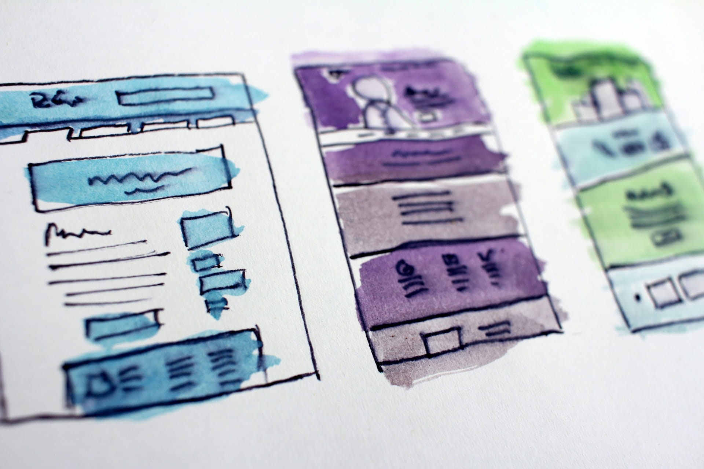

Aprender programación de aplicaciones web se ha convertido en una de las especialidades más deseadas en el mundo de la programación. Recuerdo como 10 años antes aprenderlo no era tan sencillo como hoy. En todo este tiempo aumentó la complejidad y diversidad de cosas que puedes hacer en una aplicación web; también mejoró la facilidad de aprendizaje mediante la abstracción y estandarización de muchas de las técnicas utilizadas para crear una aplicación web.

En este artículo está hecho para quien quiere empezar a estudiar desarrollo web y no sabe por dónde comenzar. Resumiré, a lo que considero, y sin entrar en muchos detalles técnicos o complejos, la forma correcta de aprender programación de aplicaciones web desde cero.

## Lo primero y más importante que necesitas entender

Estudia, aprende y práctica con proyectos reales. Parece obvio, pero no lo es tanto. En estos días nunca ha sido tan fácil crear una aplicación o sitio web; leyendo un tutorial en un blog, viendo un video en youtube o usando herramientas que crean sitios (Wordpress, Drupal, Wix) eres capaz de hacerlo.

Una vez terminado el tutorial piensas que eres un desarrollador web en plena y completa capacidad. Lo cierto es que no serás capaz de crear otro sitio web con más funcionalidad, ni mejor que la mera copia que acabas de hacer en el tutorial. Para ir más allá necesitas entender y aprender las bases.

## Empieza por las bases y domina HTML, CSS y Javascript

Lo principal que tienes que aprender en la programación de aplicaciones web es [HTML](https://es.wikipedia.org/wiki/HTML), [CSS](https://es.wikipedia.org/wiki/Hoja_de_estilos_en_cascada) y [Javascript](https://es.wikipedia.org/wiki/JavaScript). Olvida por el momento los excelentes frameworks, librerías y soluciones del tipo hago todo y que parece ser magia para ti. Céntrate en estudiar a fondo estas bases y aprenderlas bien. Dedicandote a dominar esto puedes llegar a ser un desarrollador web de muy altísimo nivel ya que todas las soluciones están creadas sobre estas tres bases.

## HTML (Lenguaje de marcas de hipertexto o Hyper Text Markup Language)

Una aplicación o sitio web es básicamente un documento estructurado donde puedes mostrar textos, imágenes, videos, enlaces a otros documentos (hipervínculos) y otra serie de elementos. Estos documentos son mostrados a través de un navegador web (Google Chrome, Firefox, Opera, Microsoft Edge). El HTML es un lenguaje de marcado, en pocas palabras es el encargado de definir la estructura del documento para que el navegador lo procese y muestre una versión organizada de la información.

HTML está compuesto de algo llamado etiquetas y cada etiqueta tiene un papel a desempeñar dentro de la estructura del documento. Estas etiquetas, a su vez, tienen atributos, los cuales definen ciertas propiedades y comportamientos de las etiquetas que pertenecen. Las etiquetas están organizadas en una especie de árbol jerárquico donde existe una etiqueta que será la raíz de tu documento y esta tiene varias etiquetas hijas, dónde estas etiquetas, tienen otras etiquetas hijas y así sucesivamente.

Una vez entendido qué es HTML y como funciona, ya puedes empezar a estructurar el contenido de tus documentos. Ahora el siguiente paso es aprender cómo definir el diseño visual de la estructura de nuestro documento.

## CSS (Hojas de Estilo en Cascada o Cascading Style Sheets)

Este es un lenguaje de presentación usado para definir el diseño del documento estructurado con HTML. 

El CSS usa algo llamado selectores. Estos apuntan a determinada etiqueta en nuestro documento, puede establecer propiedades (color, ancho, alto, tamaño, etc.) y el valor de estas propiedades afectan el diseño y presentación de la etiqueta.

Cuando estés estudiando y aprendiendo HTML te darás cuenta que puedes cambiar muchos aspectos del diseño visual de tu documento (color, bordes, ancho, alto, etc.). Y la pregunta es, ¿Si puedo cambiar el diseño de mi documento usando HTML para que necesito CSS?

El objetivo principal del CSS es separar el diseño de la estructura del documento creada con HTML. De esta forma tienes una separación entre estructura y diseño; dando ventajas como modificar el diseño  de una etiqueta teniendo un selector que apunte en cualquier lugar del documento que está definida dicha etiqueta.

El CSS también permite controlar cómo será mostrado el diseño de tu sitio o aplicación web dependiendo del dispositivo (computador, tablet, móvil) que está mostrando el documento. Esto es llamado responsive design y es un punto clave a dominar como desarrollador web.

## Javascript

Usando HTML y CSS controlamos la estructura y diseño del documento. Llegados a este punto tenemos un sitio web estático y ya es un sitio web funcional. Ahora podríamos darle interactividad y dinamismo. De esta forma mejoramos la experiencia de quien consume la información del documento y también nos permitirá crear más funcionalidad. Esto le dará a tu sitio o aplicación web funcionalidades imposibles de lograr en un sitio web estático creado solo con HTML y CSS.

Para lograr dicha interactividad necesitas aprender javascript. Este es un lenguaje de programación de tipo interpretado usado principalmente por los navegadores web. Los navegadores interpretan el código javascript y permite agregar interactividad al documento, creando aplicaciones web dinámicas.

El javascript ha tenido una gran evolución desde sus comienzos. Cuando antes sólo permitía agregar algunos efectos al documento y la compatibilidad entre navegadores no era la mejor; hoy se pueden hacer infinidades de funcionalidades complejas, como hacer peticiones a un servidor y traer la información para presentarla en el documento de manera dinámica ([Ajax](https://es.wikipedia.org/wiki/AJAX)).

También mencionar a [jQuery](https://es.wikipedia.org/wiki/JQuery), una librería creada en javascript que impulsó el uso y la popularidad del lenguaje. Hoy ya no es necesario esta librería para desarrollar aplicaciones web pero sigue siendo importante aprenderla porque muchas aplicaciones web aun la usan.

Otro punto para agregar de javascript es que, no solo se ejecuta en los navegadores web. También se creó un entorno de ejecución basado en el motor del navegador Google Chrome capaz de ejecutar código javascript en cualquier entorno fuera de los navegadores web. Este entorno de ejecución es llamado [Node.js](https://es.wikipedia.org/wiki/Node.js).

## Desarrollador web frontend

Dominando HTML, CSS y Javascript ya puedes considerarte un desarrollador web. Al menos un desarrollador web del lado del cliente ([desarrollador frontend](https://es.wikipedia.org/wiki/Front_end_y_back_end)), pero ya eres capaz de crear un sitio o aplicación web que se ajuste a la solución personalizada que desees.

Si no sabes por dónde comenzar a estudiar te comparto el curso de [Introducción al Desarrollo Web](https://ed.team/especialidades/web) que está publicado en la plataforma de aprendizaje [EDteam](https://ed.team/). Es gratis y un buen punto de partida para iniciantes.

Como desarrollador web frontend que ha dominado las bases necesarias puedes empezar a expandir tus conocimientos y productividad usando librerías y frameworks. Estas librerías y frameworks es como un paquete de código ya hecho y listo para usar, con funcionalidades definidas que usas en el desarrollo web del día a día. Usarlas parte de un principio básico en programación llamado “[no reinventar la rueda](https://es.wikipedia.org/wiki/Reinventar_la_rueda)".

No te mencionare ninguno de estos frameworks o librerías ya que existen cantidades considerables y cada una ellas genera mucho contenido de debate, y se salen del propósito de este artículo.

## Aprender programación del lado del servidor (Desarrollador web backend)

Para aumentar tu campo de conocimiento sobre programación de aplicaciones web, aún te falta otro tema por aprender y es la programación del lado del servidor. Esta hace referencia al [desarrollador web backend](https://es.wikipedia.org/wiki/Front_end_y_back_end). Consiste en crear y ejecutar código en un servidor web, donde manejas muchos aspectos como la persistencia de datos, autorización y autenticación de usuarios, crear una [API REST](https://es.wikipedia.org/wiki/Transferencia_de_Estado_Representacional) para ser consumida por tu sitio o aplicación web del lado del cliente; y en resumen, ejecutar acciones que dada su naturaleza no pueden ser ejecutadas en un navegador web.

El desarrollo web backend es un mundo, que aunque relacionado, es casi completamente diferente al desarrollo frontend. De ahí que, muchos programadores se especialicen en un área u otra. Esto no quiere decir que no puedas hacer los dos tipos de desarrollo, si es posible, solo tienes que estudiar más y eventualmente terminarás siendo un desarrollador web que domina las dos especializaciones, y que muchos a estos los llaman desarrollador web full stack.

Aprende un lenguaje de programación, en teoría cualquier lenguaje de programación sirve para ser ejecutado del lado del servidor. Uno de los más comunes son [PHP](https://es.wikipedia.org/wiki/PHP), [Python](https://es.wikipedia.org/wiki/Python), [Ruby](https://es.wikipedia.org/wiki/Ruby), [Java](https://es.wikipedia.org/wiki/Java_(lenguaje_de_programaci%C3%B3n)) e incluso javascript apoyado en el entorno de ejecución Node.js que mencione antes.

Mencionar que en el ámbito de aprender programación del lado del servidor es muy importante obtener conocimientos de base de datos, al menos a un nivel de entendimiento intermedio. Las dos ramas importantes aquí son las base de datos [SQL](https://es.wikipedia.org/wiki/SQL) y [NOSQL](https://es.wikipedia.org/wiki/NoSQL), aprendan bien como usar cada una de estas.

## Git, no obligatorio, pero una de las herramientas más importante para un desarrollador web

[Git](https://es.wikipedia.org/wiki/Git) es un sistema de control de versiones de tu código fuente. Es la manera más eficiente y confiable para guardar un registro histórico de los cambios que se realizan en tu proyecto de aplicación o sitio web. Permite el trabajo colaborativo haciendo más fácil la gestión del código de los miembros de tu equipo de desarrollo. Es una herramienta imprescindible que todo desarrollador web o un programador de software debe aprender.

## Aprendí todo lo que necesito de programación de aplicaciones web. ¿Ahora que?

Ya estás listo para crear ese proyecto web que siempre has querido hacer. Ya tienes las habilidades necesarias para ser elegible y trabajar en una empresa donde necesiten un desarrollador web. Ahora puedes empezar a trabajar como freelancer, existen muchas personas que necesitan un desarrollador web. 

Aumenta tu campo de conocimiento aprendiendo y dominando frameworks y librerías; estas te harán tu vida de desarrollador web mucho más fácil. 

Siempre sigue estudiando. El desarrollo web está en constante evolución. Esto es uno de los puntos que más emoción me da en el desarrollo web, llevo años programando, y de aquel tiempo a hoy, aunque se han mantenido las bases, las formas de crear aplicaciones web han cambiado muchísimo (para mejor) y lo seguirán haciendo.

¡Terminamos! Espero que les haya servido este resumen y bienvenidos al mundo de la programación de aplicaciones web.
