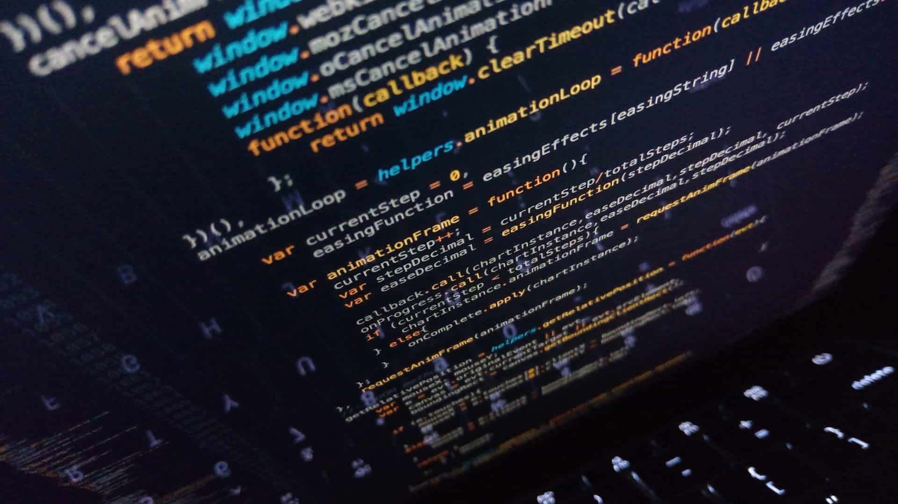

Saber como usar una función callback en javascript es un conocimiento básico a dominar para cualquier programador en javascript sin importar el entorno de ejecución (navegador web, node.js, etc.). Las funciones callbacks en javascript es uno de los conceptos más importante que debes aprender como desarrollador web. Dedica un tiempo y entiende bien como funcionan.

En este artículo te explicaré que es una función callback en javascript. Aprenderás cómo funcionan, los diferentes tipos de estilos que tiene una función callback en javascript. Al final te daré algunos consejos y buenas prácticas para usarlas correctamente.

## Cómo funcionan las callbacks en javascript

Una función callback en javascript (y como concepto general) es una función que se usa para propagar el resultado de una operación. Esta función callback se pasa como parámetro a otra función, y es llamada con un resultado cuando la función complete su operación. Te parece complicado, hagamos un ejemplo para entenderlo mejor.

```javascript:title=Ejemplo-1
function myCallback(message) {
  console.log(message);
}

function welcome(name, myCallback) {
  const message = `Welcome ${name}`;
  myCallback(message);
}

welcome('Antonio', myCallback);

// Resultado en pantalla
// Welcome Antonio
```

En el ejemplo 1 creo una función `welcome` y le pasó como segundo parámetro otra función `myCallback`. De esta forma, el resultado de la función `welcome` se propaga en la función callback al llamar `myCallback`.

En javascript las funciones son [objetos de primera clase](https://developer.mozilla.org/es/docs/Web/JavaScript/Referencia/Funciones). Estas pueden ser usadas como variables, pasarlas como parámetros y son manipulables como cualquier otro objeto. Dada la naturaleza de las funciones en javascript se hace sencillo e intuitivo el uso de callbacks.

## Callbacks en javascript: operaciones síncronas y asíncronas

Seguro notaste en el ejemplo 1, que `welcome` es una función síncrona. Aquí te podrías preguntar si una función callback en javascript es solo para controlar el resultado devuelto en funciones asíncronas. Esto no es del todo cierto.

Las callbacks en javascript vienen de un concepto general de programación funcional llamado **continuation-passing style** (estilo con paso continuo). Este concepto, no está siempre asociado a operaciones asíncronas. Solo indica cómo propagar el resultado hacia otra función (una función callback), en vez de devolver el resultado usando el `return` de la función.

Teniendo en cuenta el concepto del **estilo con paso continuo**, que están basadas las funciones callbacks en javascript, es válido manejar operaciones síncronas o asíncronas.

## Estilos de uso de una callback en javascript

### Estilo con paso continuo síncrono

Para entender este estilo pondré el ejemplo de una simple función síncrona.

```javascript:title=Ejemplo-2
function add(a, b) {
  return a + b;
}

console.log(add(3, 5));

// Resultado en pantalla
// 8
```

El ejemplo 2 es una función normal, donde el resultado de la operación es devuelto usando la instrucción `return`; esto es llamado el **estilo directo**, y es la forma más común de devolver un resultado en una operación síncrona.

El equivalente al ejemplo 2 del estilo directo usando una función callback en javascript quedaría así.

```javascript:title=Ejemplo-3
function add(a, b, callback) {
  callback(a + b);
}

console.log('Antes de la ejecucion');
add(3, 5, function(result) {
  console.log(result);
});
console.log('Despues de la ejecucion');

// Resultado en pantalla
// Antes de la ejecucion
// 8
// Despues de la ejecucion
```

El ejemplo 3 es una función síncrona y obtenemos el resultado cuando la función callback es pasada como tercer parámetro y ejecutada. En este caso el código es ejecutado según su orden.

### Estilo con paso continuo asíncrono

Modifiquemos el ejemplo 3 y agreguemos dentro de la función `add` una función asíncrona y verás que sucede.

```javascript:title=Ejemplo-4
function add(a, b, callback) {
  setTimeout(function() {
    callback(a + b);
  }, 500);
}

console.log('Antes de la ejecucion');
add(3, 5, function(result) {
  console.log(result);
});
console.log('Despues de la ejecucion');

// Resultado en pantalla
// Antes de la ejecucion
// Despues de la ejecucion
// 8
```

En el ejemplo 4 cambia el orden de la ejecución del código, mostrando al final el resultado de la suma. Usamos la función `setTimeout` para simular una operación asíncrona. La función `setTimeout` toma como primer parámetro una función callback y como segundo parámetro el tiempo de demora en ejecutar el contenido de la función callback. [Más información sobre `setTimeout`.](https://developer.mozilla.org/es/docs/Web/API/WindowTimers/setTimeout)

Como `setTimeout` es una función asíncrona, no espera para ejecutar el código de la función callback; lo que hace es devolver el control a la función `add`, y esta sigue la ejecución del programa, dejando la función callback a la espera en el [ciclo de eventos de javascript](https://developer.mozilla.org/es/docs/Web/JavaScript/EventLoop) para ser ejecutada. Este es el funcionamiento por defecto de como javascript maneja las operaciones asíncronas.

### Estilo de una función callback en javascript sin paso de continuo

Existen algunos casos, en el que puedes llegar a pensar que una función callback en javascript esté usando el estilo de paso continuo síncrono o asíncrono. Estos casos, no siempre son así. Usaré el método `map` como ejemplo para demostrarlo.

```javascript:title=Ejemplo-5
const result = [1, 2, 3, 4, 5].map(function(item) {
  return item * 2;
});

console.log(result);

// Resultado en pantalla
// [2, 4, 6, 8, 10]
```

En el ejemplo 5, la función callback es usada para obtener el elemento que itera sobre el arreglo, y no para propagar el resultado. Incluso, el resultado es devuelto de forma síncrona usando el estilo directo, es decir, devolviendo el resultado usando la instrucción `return`.

## Consejos y buenas prácticas al usar una función callback en javascript

Implementar una función callback en javascript es fácil, una vez que entiendas cómo funciona. Si no la usas de forma correcta, a medida que tu código crece en complejidad, puedes terminar con un código muy ilegible, difícil de depurar y, caer en algunos de los antipatrones más comunes al usar funciones callbacks en javascript. Te escribo algunos consejos y buenas prácticas para cuando las uses.

- **Callback al final:** Usa la función callback como último parámetro. La mayoría de las funciones callbacks son funciones anónimas, creadas donde pasas los parámetros. Al ubicar la función callback al final y creas una función anónima, tu código quedará más legible

- **Errores primeros:** Para propagar los errores usando el **estilo con paso continuo** es necesario pasarlo como parámetro de la función callback (Usando el **estilo directo**, normalmente lo haces con `try, catch y throw`). Una buena práctica es pasarlo como primer parámetro en la función callback y sea de tipo `Error` o `null` (caso no tener errores).

- **Evita las callbacks hell:** Las callbacks hell es un antipatrón muy común cuando usas callbacks en javascript. Este sucede, cuando tienes muchas callbacks anidadas, dando como resultado la dificultad de leer o seguir la estructura del código. Para evitarlas intenta no crear muchos niveles de anidación, usa funciones normales en vez de funciones anónimas para separar las callbacks, [usa promesas y `async/await`](https://developer.mozilla.org/es/docs/Web/JavaScript/Guide/Usar_promesas) (una solución más moderna de cómo manejar operaciones asíncronas)

- **Prefiere el estilo directo:** Si usas solo funciones puramente síncronas, es recomendable usar el **estilo directo**, en vez de, propagar el resultado usando una función callback.

- **Conoce el estilo de la función:** Siempre lee la documentación de la función que usa la callback para saber que tipo de estilo está usando. Conociendo el estilo de la función puedes determinar el diseño de tu código.

Espero que en este artículo hallas podido entender como usar una función callback en javascript, o si ya lo sabías, haber consolidado o ampliado ese conocimiento. La mejor forma de dominar el uso de funciones callbacks es practicando con ellas. Mientras no olvides la teoría y las buenas prácticas puedes sacar buen provecho con su uso.
